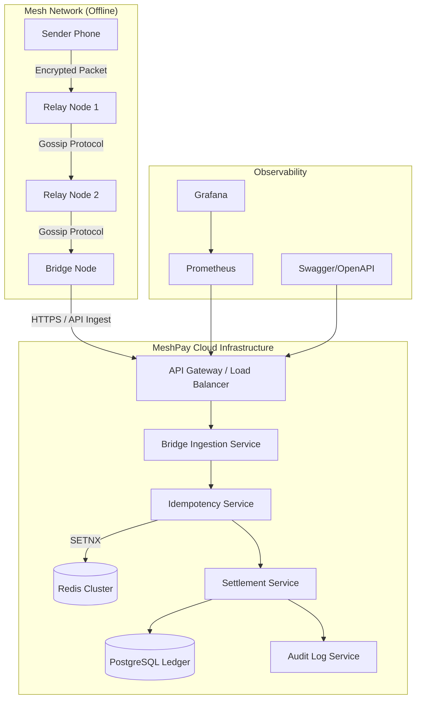

# MeshPay: Production-Grade Distributed Mesh Infrastructure for Offline Payments

[](https://opensource.org/licenses/MIT)
[](https://www.oracle.com/java/)
[](https://spring.io/projects/spring-boot)
[](#security-model)

MeshPay is a high-performance, secure backend infrastructure designed to enable peer-to-peer fund transfers in environments with **zero internet connectivity**. By leveraging an encrypted mesh network protocol, transaction packets propagate through nearby devices until reaching a "bridge node" for centralized settlement.

---

## 🚀 Overview

In remote or infrastructure-compromised regions, traditional payment systems fail due to their reliance on persistent internet connectivity. MeshPay solves this by decoupling **transaction initiation** from **settlement**.

### The Core Protocol
1.  **Encrypted Initiation**: A sender's device generates an E2E encrypted packet containing payment instructions.
2.  **Mesh Propagation**: Packets use Bluetooth/WiFi-Direct (simulated) to "gossip" through the network.
3.  **Bridge Settlement**: Any device with internet access (Bridge Node) automatically uploads collected packets to the MeshPay backend.
4.  **Atomic Settlement**: The backend uses distributed idempotency claims to ensure each transaction is settled **exactly once**, regardless of how many times it was delivered.

---

## 🏗️ Architecture & System Design

### High-Level Component Diagram



### Technical Stack
*   **Backend**: Spring Boot 3.3 (Java 17)
*   **Persistence**: PostgreSQL (Transactions/Accounts)
*   **Caching/Idempotency**: Redis (Distributed locks & claims)
*   **Security**: Spring Security 6 (OAuth2/JWT, TLS 1.3)
*   **Resilience**: Resilience4j (Rate limiting, Circuit breaking)
*   **Observability**: Micrometer, Prometheus, Actuator

---

## 🔐 Security Model

MeshPay is designed with a "Zero Trust" approach toward the mesh network.

### 1. Hybrid Encryption (RSA-2048 + AES-256-GCM)
We use a hybrid cryptosystem to ensure confidentiality and integrity:
*   **Payload Encryption**: AES-256 in **GCM (Galois/Counter Mode)** provides both encryption and authentication. Any bit-flip by an intermediate node causes decryption to fail.
*   **Key Exchange**: The AES session key is wrapped using **RSA-2048 with OAEP padding** using the server's public key.

### 2. Distributed Idempotency
To prevent double-spending in a "duplicate-storm" scenario:
1.  A **SHA-256 hash** of the ciphertext is computed immediately upon ingestion.
2.  An atomic **claim** is attempted in Redis (`SET hash timestamp NX EX 3600`).
3.  If the claim fails, the packet is discarded as a duplicate before any business logic executes.

### 3. Role-Based Access Control (RBAC)
*   `ROLE_BRIDGE_NODE`: Authorized to submit packets for settlement.
*   `ROLE_USER`: Authorized to view personal accounts and history.
*   `ROLE_ADMIN`: Full access to system metrics, logs, and management APIs.

---

## ⚡ Getting Started

### Prerequisites
*   Java 17 or higher
*   Docker & Docker Compose (recommended)
*   Maven 3.8+

### Quick Start (Local)
```bash
# 1. Clone the repository
git clone https://github.com/aryangaikwad-966/Meshpay.git
cd Meshpay

# 2. Start Infrastructure (Postgres + Redis)
docker-compose up -d postgres redis

# 3. Run the Application
./mvnw spring-boot:run
```
The application will be available at `http://localhost:8080`.

### Using the Demo Dashboard
The project includes an interactive **Network Simulator** at `http://localhost:8080/`. You can:
1.  **Inject** a payment from Alice to Bob.
2.  **Gossip** the packet through virtual offline nodes.
3.  **Flush** bridge nodes to see real-time settlement on the ledger.

---

## 📊 Observability & Operations

### Monitoring Endpoints
*   **Health Checks**: `GET /actuator/health`
*   **Metrics (Prometheus)**: `GET /actuator/prometheus`
*   **API Docs (Swagger)**: `GET /swagger-ui/index.html`

### Performance Benchmarks
*   **Ingestion Latency**: < 50ms (average)
*   **Concurrency**: Optimized for 1000+ simultaneous bridge uploads per second via non-blocking idempotency checks.

---

## 🛠️ Development & Contributing

### Project Structure
```text
src/main/java/com/demo/upimesh/
├── config/             # Security, Redis, and App configurations
├── controller/         # REST API Controllers & Exception Handlers
├── crypto/             # RSA/AES Hybrid Encryption Logic
├── model/              # JPA Entities and Repository Interfaces
├── security/           # Audit Filters and JWT Logic
└── service/            # Core Business & Mesh Simulation Logic
```

### Running Tests
We enforce a high-quality testing standard, including concurrency and security tests.
```bash
./mvnw test
```

---

## 📝 License
This project is licensed under the MIT License - see the [LICENSE](LICENSE) file for details.

---
<div align="center">
  Made with ❤️ by the MeshPay Engineering Team
</div>
