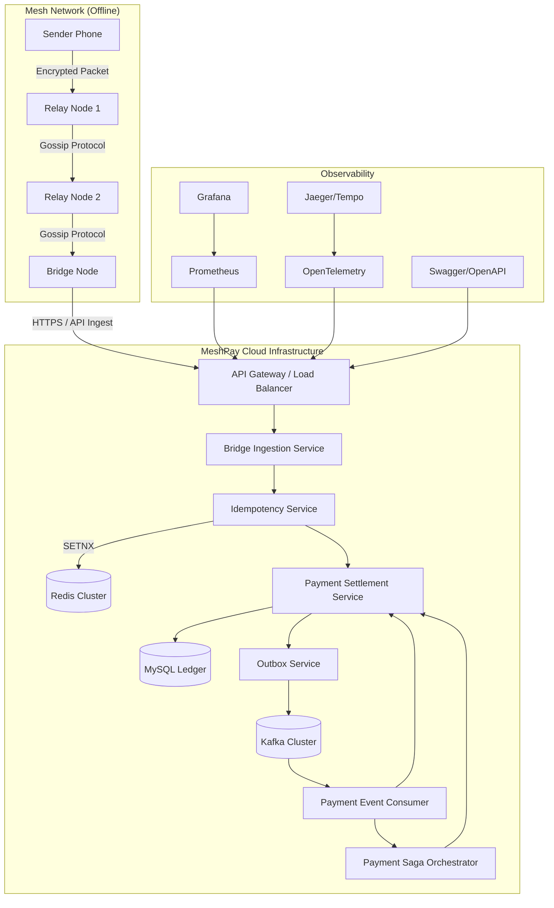

# MeshPay: Production-Grade Distributed Mesh Infrastructure for Offline Payments

[](https://opensource.org/licenses/MIT)
[](https://www.oracle.com/java/)
[](https://spring.io/projects/spring-boot)
[](#security-model)

MeshPay is a high-performance, secure backend infrastructure designed to enable peer-to-peer fund transfers in environments with **zero internet connectivity**. By leveraging an encrypted mesh network protocol, transaction packets propagate through nearby devices until reaching a "bridge node" for centralized settlement.

---

## 🚀 Overview

In remote or infrastructure-compromised regions, traditional payment systems fail due to their reliance on persistent internet connectivity. MeshPay solves this by decoupling **transaction initiation** from **settlement**.

### The Core Protocol
1.  **Encrypted Initiation**: A sender's device generates an E2E encrypted packet containing payment instructions.
2.  **Mesh Propagation**: Packets use Bluetooth/WiFi-Direct (simulated) to "gossip" through the network.
3.  **Bridge Settlement**: Any device with internet access (Bridge Node) automatically uploads collected packets to the MeshPay backend.
4.  **Atomic Settlement**: The backend uses distributed idempotency claims to ensure each transaction is settled **exactly once**, regardless of how many times it was delivered.

---

## 🏗️ Architecture & System Design

### High-Level Component Diagram


```mermaid
graph TD
    subgraph "Mesh Network (Offline)"
        A[Sender Phone] -- "Encrypted Packet" --> B[Relay Node 1]
        B -- "Gossip Protocol" --> C[Relay Node 2]
        C -- "Gossip Protocol" --> D[Bridge Node]
    end

    subgraph "MeshPay Cloud Infrastructure"
        D -- "HTTPS / API Ingest" --> E[API Gateway / Load Balancer]
        E --> F[Bridge Ingestion Service]
        F --> G[Idempotency Service]
        G -- "SETNX" --> H[(Redis Cluster)]
        G --> I[Payment Settlement Service]
        I --> J[(MySQL Ledger)]
        I --> K[Outbox Service]
        K --> L[(Kafka Cluster)]
        L --> M[Payment Event Consumer]
        M --> I
        M --> N[Payment Saga Orchestrator]
        N --> I
    end

    subgraph "Observability"
        O[Prometheus] --> E
        P[Grafana] --> O
        Q[OpenTelemetry] --> E
        R[Jaeger/Tempo] --> Q
        S[Swagger/OpenAPI] --> E
    end
```

### Technical Stack
*   **Backend**: Spring Boot 3.3.5 (Java 17)
*   **Database**: MySQL 8.0 (primary), H2 (development/testing)
*   **Cache**: Redis 7 with Jedis client
*   **Message Broker**: Apache Kafka 3.x for event-driven architecture
*   **Security**: Spring Security 6 with OAuth2/JWT
*   **Resilience**: Resilience4j (circuit breakers, retries, rate limiting, time limiters)
*   **Monitoring**: Prometheus, Micrometer, Spring Boot Actuator
*   **Distributed Tracing**: OpenTelemetry with OTLP exporter
*   **Documentation**: OpenAPI/Swagger 3.0
*   **Build**: Maven 3.8+
*   **Containerization**: Docker with multi-stage builds

---

## 🔐 Security Model

MeshPay is designed with a "Zero Trust" approach toward the mesh network.

### 1. Hybrid Encryption (RSA-2048 + AES-256-GCM)
We use a hybrid cryptosystem to ensure confidentiality and integrity:
*   **Payload Encryption**: AES-256 in **GCM (Galois/Counter Mode)** provides both encryption and authentication. Any bit-flip by an intermediate node causes decryption to fail.
*   **Key Exchange**: The AES session key is wrapped using **RSA-2048 with OAEP padding** using the server's public key.

### 2. Distributed Idempotency
To prevent double-spending in a "duplicate-storm" scenario:
1.  A **SHA-256 hash** of the ciphertext is computed immediately upon ingestion.
2.  An atomic **claim** is attempted in Redis (`SET hash timestamp NX EX 3600`).
3.  If the claim fails, the packet is discarded as a duplicate before any business logic executes.

### 3. Role-Based Access Control (RBAC)
*   `ROLE_BRIDGE_NODE`: Authorized to submit packets for settlement.
*   `ROLE_USER`: Authorized to view personal accounts and history.
*   `ROLE_ADMIN`: Full access to system metrics, logs, and management APIs.

---

## 🔄 Event-Driven Architecture

MeshPay uses an event-driven architecture with Kafka for reliable, asynchronous payment processing.

### Key Patterns

**Transactional Outbox Pattern**
- Events are written to the outbox table in the same transaction as business data
- A scheduled processor publishes events to Kafka
- Ensures exactly-once event delivery

**Saga Pattern**
- Distributed transactions are managed using the Saga pattern
- Each saga step has a compensation action for failure recovery
- Supports complex multi-step payment settlement flows

**Idempotent Consumers**
- Kafka consumers track processed events to prevent duplicate processing
- Uses event_processed table for idempotency
- Ensures exactly-once processing semantics

### Event Flow

```
PaymentReceived → PaymentValidated → SettlementRequested → PaymentSettled
     ↓                  ↓                    ↓                  ↓
   Kafka             Kafka                Kafka              Kafka
     ↓                  ↓                    ↓                  ↓
   Consumer          Consumer             Consumer           Consumer
     ↓                  ↓                    ↓                  ↓
   Validation      Settlement          Settlement          Balance
                    Request             Completion          Update
```

### Topics

- `payment-received` - Initial payment events
- `payment-validated` - Validation completion events
- `payment-settlement-requested` - Settlement request events
- `payment-settled` - Final settlement events
- `payment-failed` - Failure events
- `payment-dlq` - Dead letter queue for failed events

---

## ⚡ Getting Started

### Prerequisites
*   Java 17 or higher
*   Docker & Docker Compose (recommended)
*   Maven 3.8+

### Quick Start (Local)
```bash
# 1. Clone the repository
git clone https://github.com/aryangaikwad-966/Meshpay.git
cd Meshpay

# 2. Start Infrastructure (MySQL + Redis + Kafka)
docker-compose up -d mysql redis kafka

# 3. Run the Application
./mvnw spring-boot:run
```
The application will be available at `http://localhost:8080`.

### Using the Demo Dashboard
The project includes an interactive **Network Simulator** at `http://localhost:8080/`. You can:
1.  **Inject** a payment from Alice to Bob.
2.  **Gossip** the packet through virtual offline nodes.
3.  **Flush** bridge nodes to see real-time settlement on the ledger.

---

## 📊 Observability & Operations

### Monitoring Endpoints
*   **Health Checks**: `GET /actuator/health`
*   **Metrics (Prometheus)**: `GET /actuator/prometheus`
*   **API Docs (Swagger)**: `GET /swagger-ui/index.html`

### Performance Benchmarks
*   **Ingestion Latency**: < 50ms (average)
*   **Concurrency**: Optimized for 1000+ simultaneous bridge uploads per second via non-blocking idempotency checks.

---

## 🛠️ Development & Contributing

### Project Structure
```text
src/main/java/com/demo/upimesh/
├── config/             # Security, Redis, Kafka, and App configurations
├── controller/         # REST API Controllers & Exception Handlers
├── crypto/             # RSA/AES Hybrid Encryption Logic
├── consumer/           # Kafka Event Consumers
├── events/             # Event DTOs and Envelope
├── metrics/            # Custom Metrics (PaymentMetrics)
├── model/              # JPA Entities and Repository Interfaces
├── saga/               # Saga Pattern Implementation
├── security/           # Audit Filters and JWT Logic
└── service/            # Core Business & Mesh Simulation Logic
```

### Running Tests
We enforce a high-quality testing standard, including concurrency and security tests.
```bash
./mvnw test
```

### Additional Documentation
- **Security Verification**: See [SECURITY_VERIFICATION.md](SECURITY_VERIFICATION.md) for security analysis and recommendations
- **Data Ownership**: See [DATA_OWNERSHIP.md](DATA_OWNERSHIP.md) for MySQL data ownership boundaries and migration details
- **Deployment Guide**: See [DEPLOYMENT.md](DEPLOYMENT.md) for production deployment strategies

---

## 📝 License
This project is licensed under the MIT License - see the [LICENSE](LICENSE) file for details.

---
<div align="center">
  Made with ❤️ by the MeshPay Engineering Team
</div>
